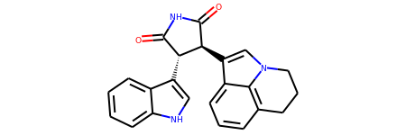
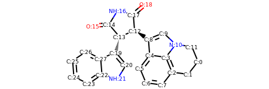
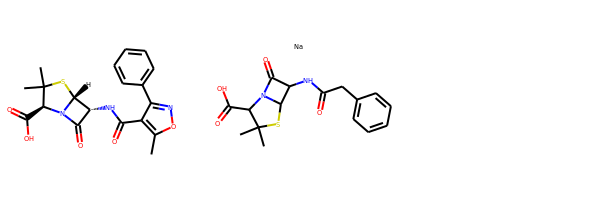
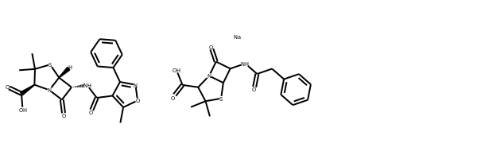
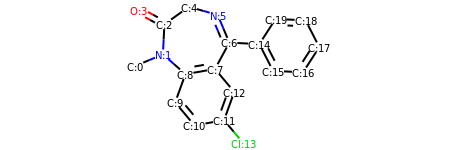
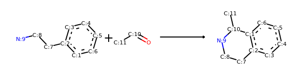
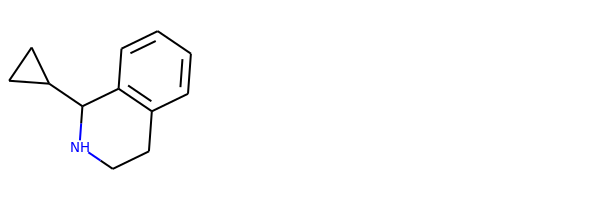
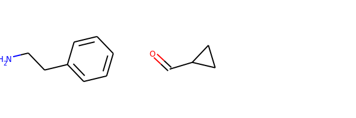

RDKit Cookbook v2
%%%%%%%%%%%%%%%%%%%%

.. contents:: :local:

.. sectionauthor:: Vincent F. Scalfani <vfscalfani@ua.edu>

Introduction
**************

What is this?
===============

This document provides examples of how to carry out particular tasks using the RDKit functionality
from Python. The contents have been contributed by the RDKit community, tested with the latest 
RDKit release, and then compiled into this document. Note that this document is the second 
iteration of the :doc:`Cookbook` (i.e., v2). The old Cookbook written in Markdown is no longer 
maintained, but is available in prior RDKit releases for reference. The RDKit Cookbook v2 
is written in reStructuredText, which supports Sphinx doctests, allowing for easier 
validation and maintenance of the RDKit Cookbook v2 code examples, where appropriate. 

What gets included?
=====================

The examples included come from various online sources such as blogs, shared gists, and 
the RDKit mailing lists.  Generally, only minimal editing is added to the examples for 
formatting consistency and to incorporate the doctests. We have made a conscious effort 
to appropriately credit the original source and authors. For now, we are including anything 
that seems useful and reusable. One of the first priorities of this document is to compile useful **short**
examples shared on the RDKit mailing lists, as these can be difficult to discover. 
It will take some time, but we hope to expand this document into 100s of examples. 
As the document grows, it may make sense to prioritize examples included in the RDKit Cookbook 
v2 based on community demand.

Feedback
=========

If you have suggestions for how to improve the Cookbook v2 and/or examples you would like 
included, please contribute directly in the source document (the .rst file). The Index ID# 
is simply a way to track entries, new additions are sequentially numbered. Alternatively, 
you can also send Cookbook revisions and addition requests to the mailing list:
<rdkit-discuss@lists.sourceforge.net> (you will need to subscribe first).

Drawing Molecules (in a Jupyter Environment)
**********************************************

Include an Atom Index
======================

| **Author:** Takayuki Serizawa
| **Source:** `<https://iwatobipen.wordpress.com/2017/02/25/draw-molecule-with-atom-index-in-rdkit/>`_
| **Index ID#:** RDKitCB_0
| **Summary:** Draw a molecule with atom index numbers.

.. testcode::

   from rdkit import Chem
   from rdkit.Chem.Draw import IPythonConsole
   from rdkit.Chem import Draw
   IPythonConsole.ipython_useSVG=False
   import rdkit

.. testcode::
  
   def mol_with_atom_index(mol):
       atoms = mol.GetNumAtoms()
       for idx in range(atoms):
           mol.GetAtomWithIdx(idx).SetProp('molAtomMapNumber',str(mol.GetAtomWithIdx(idx).GetIdx()))
       return mol

.. testcode::

   # Test in a kinase inhibitor
   mol = Chem.MolFromSmiles("C1CC2=C3C(=CC=C2)C(=CN3C1)[C@H]4[C@@H](C(=O)NC4=O)C5=CNC6=CC=CC=C65")
   # Default
   mol
   

.. testcode::
  
   # With atom index
   mol_with_atom_index(mol)
   

Black and White Molecules
==========================

| **Author:** Greg Landrum
| **Source:** `<https://gist.github.com/greglandrum/d85d5693e57c306e30057ec4d4d11342>`_
| **Index ID#:** RDKitCB_1
| **Summary:** Draw a molecule in black and white.

.. testcode::

   from rdkit import Chem
   from rdkit.Chem.Draw import IPythonConsole
   from rdkit.Chem import Draw
   import rdkit

.. testcode::

   ms = [Chem.MolFromSmiles(x) for x in ('Cc1onc(-c2ccccc2)c1C(=O)N[C@@H]1C(=O)N2[C@@H](C(=O)O)C(C)(C)S[C@H]12','CC1(C)SC2C(NC(=O)Cc3ccccc3)C(=O)N2C1C(=O)O.[Na]')]
   Draw.MolsToGridImage(ms)
   

.. testcode::

   IPythonConsole.drawOptions.useBWAtomPalette()
   Draw.MolsToGridImage(ms)

Highlight a Substructure in a Molecule
=======================================

| **Author:** Greg Landrum
| **Source:** `<https://gist.github.com/greglandrum/5d45b56afe75603b955103cdd0d8e038>`_
| **Index ID#:** RDKitCB_2
| **Summary:** Draw a molecule with a substructure highlight.

.. testcode::

   from rdkit import Chem
   from rdkit.Chem.Draw import IPythonConsole
   import rdkit

.. testcode::

   m = Chem.MolFromSmiles('c1cc(C(=O)O)c(OC(=O)C)cc1')
   print(m.GetSubstructMatches(Chem.MolFromSmarts('C(=O)O')))

.. testoutput::
   
   ((3, 4, 5), (8, 9, 7))
   
.. testcode::
   
   m

   

Rings, Aromaticity, and Kekulization
************************************

Count Ring Systems
=====================

| **Author:** Greg Landrum
| **Source:** `<https://gist.github.com/greglandrum/de1751a42b3cae54011041dd67ae7415>`_
| **Index ID#:** RDKitCB_3
| **Summary:** Count ring systems in a molecule

.. testcode::

   from rdkit import Chem
   from rdkit.Chem.Draw import IPythonConsole

.. testcode::

   def GetRingSystems(mol,includeSpiro=False):
        ri = mol.GetRingInfo()
        systems = []
        for ring in ri.AtomRings():
            ringAts = set(ring)
            found = False
            nSystems = []
            for system in systems:
                nInCommon = len(ringAts.intersection(system)) 
                if nInCommon and (includeSpiro or nInCommon>1):
                    ringAts = ringAts.union(system)
                else:
                    nSystems.append(system)
            nSystems.append(ringAts)
            systems = nSystems
        return systems

   mol = Chem.MolFromSmiles('CN1C(=O)CN=C(C2=C1C=CC(=C2)Cl)C3=CC=CC=C3')
   print(GetRingSystems(mol))

.. testoutput::

   [{1, 2, 4, 5, 6, 7, 8, 9, 10, 11, 12}, {14, 15, 16, 17, 18, 19}]

.. testcode::

   # Draw molecule with atom index (see RDKitCB_0)
   def mol_with_atom_index(mol):
        atoms = mol.GetNumAtoms()
        for idx in range(atoms):
            mol.GetAtomWithIdx(idx).SetProp('molAtomMapNumber',str(mol.GetAtomWithIdx(idx).GetIdx()))
        return mol
   mol_with_atom_index(mol)

Writing Molecules
*******************

Kekule SMILES
==============

| **Author:** Paulo Tosco
| **Source:** `<https://sourceforge.net/p/rdkit/mailman/message/36893087/>`_
| **Index ID#:** RDKitCB_4
| **Summary:** Kekulize a molecule and write Kekule SMILES

.. testcode::

   from rdkit import Chem
   smi = "CN1C(NC2=NC=CC=C2)=CC=C1"
   mol = Chem.MolFromSmiles(smi)
   print(Chem.MolToSmiles(mol))

.. testoutput::
 
   Cn1cccc1Nc1ccccn1

.. testcode::

   Chem.Kekulize(mol)
   print(Chem.MolToSmiles(mol, kekuleSmiles=True))

.. testoutput::

   CN1C=CC=C1NC1=NC=CC=C1

Isomeric SMILES without isotopes
=================================

| **Author:** Andrew Dalke
| **Source:** `<https://sourceforge.net/p/rdkit/mailman/message/36877847/>`_
| **Index ID#:** RDKitCB_5
| **Summary:** Write Isomeric SMILES without isotope information (i.e., only stereochemistry)

.. testcode::

   from rdkit import Chem
   def MolWithoutIsotopesToSmiles(mol):
      atom_data = [(atom, atom.GetIsotope()) for atom in mol.GetAtoms()]
      for atom, isotope in atom_data:
          if isotope:
              atom.SetIsotope(0)
      smiles = Chem.MolToSmiles(mol)
      for atom, isotope in atom_data:
          if isotope:
             atom.SetIsotope(isotope)
      return smiles
   
   mol = Chem.MolFromSmiles("[19F][13C@H]([16OH])[35Cl]")
   print(MolWithoutIsotopesToSmiles(mol))

.. testoutput::

   O[C@@H](F)Cl

*N.B.* There are two limitations noted with this Isomeric SMILES without isotopes method 
including with isotopic hydrogens, and a requirement to recalculate stereochemistry. 
See the source discussion linked above for further explanation and examples.

Reactions
***********

Reversing Reactions
=====================

| **Author:** Greg Landrum
| **Source:** `<https://gist.github.com/greglandrum/5ca4eebbe78f4d6d9b8cb03f401ad9cd>`_ and `<https://sourceforge.net/p/rdkit/mailman/message/36867857/>`_
| **Index ID#:** RDKitCB_6
| **Summary:** Decompose a reaction product into its reactants
| **Reference Note:** Example reaction from Hartenfeller [#Hartenfeller2011]_ 

.. testcode::

   from rdkit import Chem
   from rdkit.Chem import AllChem
   from rdkit.Chem import Draw

.. testcode::

   # Pictet-Spengler rxn
   rxn = AllChem.ReactionFromSmarts('[cH1:1]1:[c:2](-[CH2:7]-[CH2:8]-[NH2:9]):[c:3]:[c:4]:[c:5]:[c:6]:1.[#6:11]-[CH1;R0:10]=[OD1]>>[c:1]12:[c:2](-[CH2:7]-[CH2:8]-[NH1:9]-[C:10]-2(-[#6:11])):[c:3]:[c:4]:[c:5]:[c:6]:1')
   rxn

.. testcode::

   rxn2 = AllChem.ChemicalReaction() 
   for i in range(rxn.GetNumReactantTemplates()):
       rxn2.AddProductTemplate(rxn.GetReactantTemplate(i))
   for i in range(rxn.GetNumProductTemplates()): 
       rxn2.AddReactantTemplate(rxn.GetProductTemplate(i))
   rxn2.Initialize()

.. testcode::

   reacts = [Chem.MolFromSmiles(x) for x in ('NCCc1ccccc1','C1CC1C(=O)')]
   ps = rxn.RunReactants(reacts)
   ps0 = ps[0]
   for p in ps0:
       Chem.SanitizeMol(p)
   Draw.MolsToGridImage(ps0)

.. testcode::

   reacts = ps0
   rps = rxn2.RunReactants(reacts)
   rps0 = rps[0]
   for rp in rps0:
       Chem.SanitizeMol(rp)
   Draw.MolsToGridImage(rps0)

.. rubric:: References

.. [#Hartenfeller2011] Markus Hartenfeller, Martin Eberle, Peter Meier, Cristina Nieto-Oberhuber, Karl-Heinz Altmann, Gisbert Schneider, Edgar Jacoby, and Steffen Renner Journal of Chemical Information and Modeling 2011 51 (12), 3093-3098. DOI: 10.1021/ci200379p

License
********

.. image:: images/picture_5.png

This document is copyright (C) 2007-2020 by Greg Landrum and Vincent Scalfani.

This work is licensed under the Creative Commons Attribution-ShareAlike 4.0 License.
To view a copy of this license, visit http://creativecommons.org/licenses/by-sa/4.0/ 
or send a letter to Creative Commons, 543 Howard Street, 5th Floor, San Francisco, California, 94105, USA.

The intent of this license is similar to that of the RDKit itself. 
In simple words: “Do whatever you want with it, but please give us some credit.”

